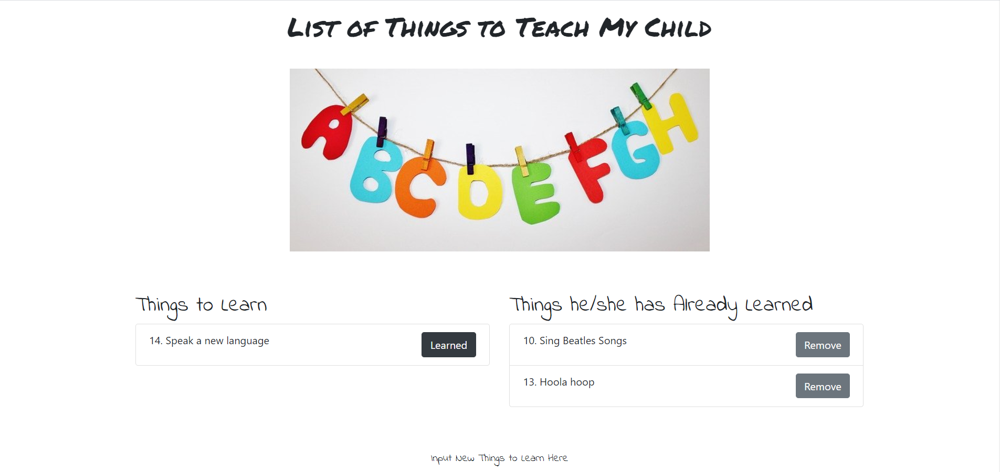

# List of Things to Teach My Child

[](https://github.com/dwyl/esta/issues)


## Description
List of Things to Teach My Child is an app which allows users to create, read, update, and delete different things he/she wants his/her child to learn.



## Table of Contents
* [Background](#background)
* [Approach](#approach)
* [Tools](#tools)
* [Site](#site)
* [License](#license)
* [Contributing](#contributing)
* [Questions](#questions)
* [Authors](#authors)

## Background
The objective of this exercise was to build an app with MySQL, Node, Express, Handlebars and a homemade ORM that follows the MVC design pattern. Node and MySQL are used to query and route data in the app, and Handlebars to generate the HTML.

Acceptance criteria is as follows:

```
* Whenever a user submits an item, app will display the item on the left side of the page 

* Each item on the left side of the page has a button. When the user clicks it, the item will move to the right side of the page.

* App will store every item in a database

```

## Approach
This project featured several areas which required specific focus:
1) Querying and routing data in the app
2) Using handlebars to generate the html

### Querying and routing data
The app was built following the MVC design pattern. Below is an example of how a delete request is handled by the app:

User clicks on the delete button of an item:

```
<div class="col-6">
            <h2 style="font-family: 'Indie Flower', cursive;">Things he/she has Already Learned</h2>
            <ul class="list-group">
                {{#each learningList}}
                {{#if mastered}}
                <li class="list-group-item remove-mastered" aria-disabled="true" data-id="{{id}}">{{id}}.
                    {{learn_name}}<button type="button" class="btn btn-secondary float-right">Remove</button></li>
                {{/if}}
                {{/each}}
            </ul>
        </div>
```
The above excerpt is from the index.handlebars file showing the code for displaying each item in the "already learned" list. Each item has a delete button, which when clicked, triggers the delete request below:

```
  // DELETE request to remove an item
  $(".remove-mastered").on("click", function (event) {
    var id = $(this).data("id");

    // Send the DELETE request.
    $.ajax("/api/list/" + id, {
      type: "DELETE",
    }).then(
      function () {
        console.log("removed list item");
        // Reload the page to get the updated list
        location.reload();
      }
    );
  });
```

The request is captured by the controller, which references the model, which references the orm to query the database and then sends a response to the browser.

Controller:

```
router.delete("/api/list/:id", function(req, res) {
  var condition = "id = " + req.params.id;

  console.log("condition", condition);

  learningList.delete(condition, function(result) {
    // Send back the ID of the new quote
    if(result.affectedRows>0){
      return res.status(200).end();
    }
    res.status(404).end();
  });
});
```
Model:

```
delete: function(vals, cb) {
    orm.deleteOne("list", vals, function(res) {
      cb(res);
    });
  }
```

ORM:

```
deleteOne: function(tableInput, condition, cb) {
        var queryString = "DELETE FROM " + tableInput + " WHERE ";
        queryString += condition;
        connection.query(queryString, function(err, result) {
          if (err) {
            throw err;
          }
          cb(result);
        });
      },
```

Another way to look at the above is to start with the orm. The orm forms the basis of query string (i.e. the delete query). The model specifies the table input in the query string. The controller takes the request and runs the query string on an argument (e.g. the id of the item to delete) and runs a call back function that returns a status code to the browser. When the browser receives the response, the page reloads and the item no longer appears in the list.

### Generating HTML with handlebars
All HTML in this app is generated with handlebars. The below code illustrates how handlebars is utilized to display items that are in the to learn list and items that are in the already learned list.

```
<div class="row pt-5">
        <div class="col-6">
            <h2 style="font-family: 'Indie Flower', cursive;">Things to Learn</h2>
            <ul class="list-group">
                {{#each learningList}}
                {{#unless mastered}}
                <li class="list-group-item change-mastered" data-id="{{id}}">{{id}}. {{learn_name}}<button type="button"
                        class="btn btn-dark float-right">Learned</button></li>
                {{/unless}}
                {{/each}}
            </ul>
        </div>
        <div class="col-6">
            <h2 style="font-family: 'Indie Flower', cursive;">Things he/she has Already Learned</h2>
            <ul class="list-group">
                {{#each learningList}}
                {{#if mastered}}
                <li class="list-group-item remove-mastered" aria-disabled="true" data-id="{{id}}">{{id}}.
                    {{learn_name}}<button type="button" class="btn btn-secondary float-right">Remove</button></li>
                {{/if}}
                {{/each}}
            </ul>
        </div>
    </div>
```

To put things simply, by leveraging handlebars, the different lists are populated based on a single flag (i.e. the mastered column in the database). When the value of this column is true, items appear in one list and when the value is false, they appear in the other.

## Tools

* [JS](https://developer.mozilla.org/en-US/docs/Web/JavaScript)
* [jquery](https://jquery.com/)
* [mysql](https://www.mysql.com/)
* [mysql NPM](https://www.npmjs.com/package/mysql)
* [express](https://expressjs.com/)
* [express-handlebars](https://www.npmjs.com/package/express-handlebars)


## License
MIT

## Contributing
Contributors are welcome. Please contact for further details.

## Questions
If you have any questions regarding this project, please email me at: qiwei.mod@gmail.com

## Authors

* **CHRISTOPHER LEE** 

- [Link to Github](https://github.com/CofChips)
- [Link to LinkedIn](https://www.linkedin.com/in/christophernlee/)
